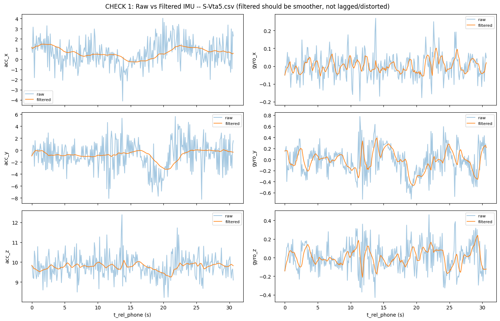
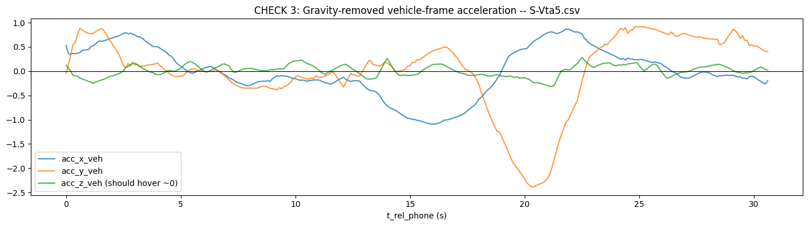

# IMU-Dead-Reckoning
# Smartphone IMU Dead Reckoning (SIH26168)

AI/ML-based Intelligent Dead Reckoning: estimates vehicle speed, heading
and position from smartphone accelerometer + gyroscope when GPS is lost.

## Pipeline
1. Raw sensor intake (10 Hz accelerometer + gyroscope)
2. Noise removal (median + Kalman filter)
3. Self-calibration / alignment (tilt from gravity, yaw from motion)
4. Gravity Removal — Isolate linear acceleration from gravity component
5. AI Speed Estimation — LSTM model estimates speed from the calibrated signal.
    Trained with a dual-constraint loss: per-window accuracy + cumulative trajectory consistency.
    Training data augmented with simulated calibration/orientation errors, so the model stays robust when Step 3's alignment is imperfect.
6. Heading estimation (gyro yaw rate with ZUPT bias correction)
7. Dead reckoning with non-holonomic constraints
8. Map matching (HMM on OpenStreetMap)
9. GNSS + INS fusion - Blend GPS when available; rely on steps 5-8 during outage (enhanced with learned confidence/noise-weighting from the AI model to guide fusion trust)

## Current status
- Done: data merge and time-sync verification, noise filtering, calibration checks
- In progress: AI speed model, heading, dead reckoning
- Not started: map matching, GNSS/INS fusion

## Results so far
1. Noise filtering
   
3. ZUPT
4. Automatic mount recalibation
5. Gravity removal 

## Files
- `Data_preprocessing_verified.py`: merges phone + vehicle data and checks time sync
- `Script_A.py`: noise filtering, calibration, ZUPT
- `Script_B_Part_1`: AI speed model (partial)

## Dataset
IO-VNBD dataset
(https://github.com/onyekpeu/IO-VNBD)

## Team - TechGen
Members - Anya, Madesh, Mahak, Chinthna, Sreenesh, Roank
